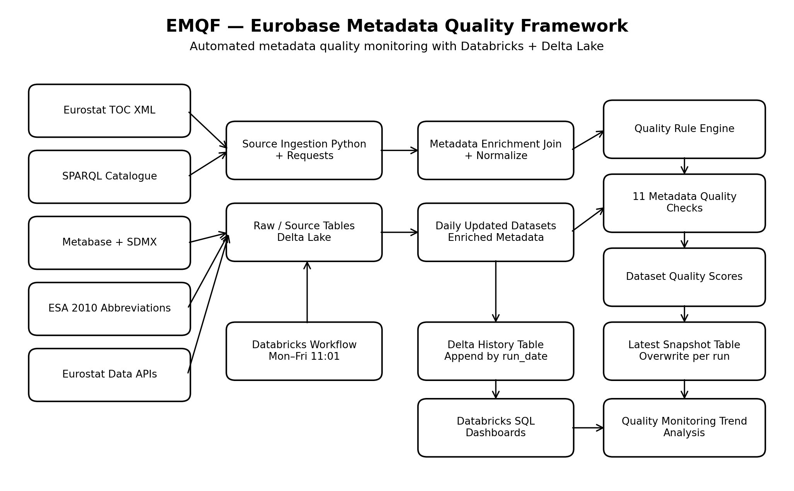
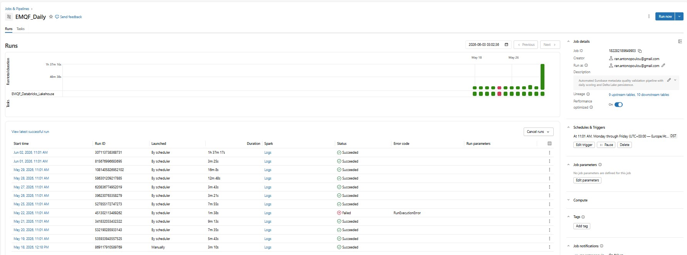
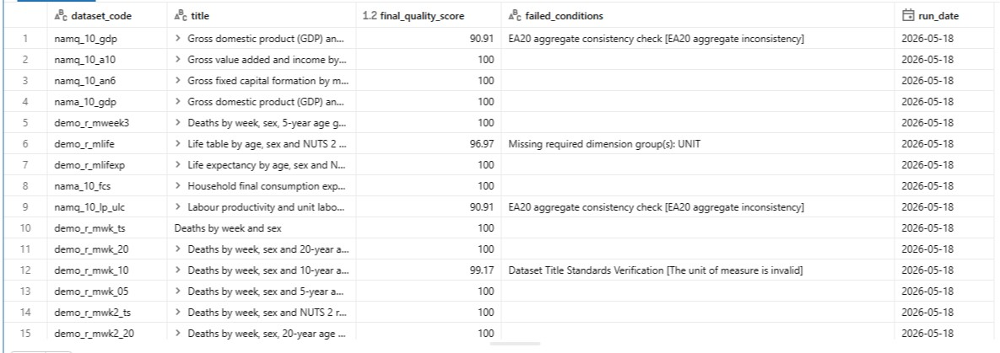
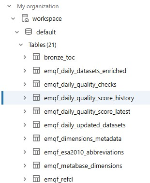

# Eurobase Metadata Quality Framework (EMQF)

## Overview


EMQF (Eurobase Metadata Quality Framework) is a Databricks-based metadata quality monitoring and validation framework designed for large-scale Eurostat/Eurobase statistical datasets.

The framework automates metadata ingestion, enrichment, validation, quality scoring, historical monitoring, and reporting workflows using PySpark, Delta Lake, and public Eurostat APIs.

Unlike traditional reporting-focused analytics projects, EMQF focuses on operational metadata governance, automated quality validation, and scalable monitoring of statistical dissemination metadata.

---

# Business Problem

Large-scale statistical metadata ecosystems frequently contain:

- missing or inconsistent metadata
- outdated dissemination structures
- non-standard codelists
- aggregate inconsistencies
- incomplete dimensional structures
- confidentiality flag mismatches

These issues can impact:

- reporting reliability
- operational monitoring
- statistical dissemination consistency
- governance and trust in analytical systems

EMQF was designed to automate metadata quality assessment and provide a scalable framework for continuous monitoring of Eurostat metadata quality.

---

# Project Objective

The goal of EMQF is to provide a repeatable and scalable framework for automated metadata quality monitoring of Eurostat datasets updated on a daily basis.

The framework answers questions such as:

- Which datasets were updated today?
- Do updated datasets follow metadata quality rules?
- Which datasets fail specific validation checks?
- How does metadata quality evolve over time?
- Which metadata quality dimensions require attention?
- Which datasets contain aggregate or confidentiality inconsistencies?

---

# High-Level Architecture



---

# Lakehouse Processing Flow

```text
Eurostat APIs / SDMX / SPARQL
                ↓
         Raw Metadata Ingestion
                ↓
         Metadata Enrichment
                ↓
      Rule-Based Quality Checks
                ↓
      Dataset Quality Scoring
                ↓
   Delta Lake Persistence Layer
 (Historical + Latest Snapshots)
                ↓
      Monitoring & Reporting
                ↓
      Databricks SQL / Power BI
```

---

# Data Sources

| Source | Purpose |
|---|---|
| Eurostat Table of Contents XML | Detect updated datasets and extract metadata fields |
| Eurostat SPARQL Catalogue | Retrieve DOI and landing page metadata |
| Eurostat Metabase | Retrieve dimensions and codelist metadata |
| Eurostat SDMX APIs | Validate dimensional and aggregate consistency rules |
| ESA 2010 Abbreviations Page | Validate acronyms used in dataset titles |

---

# Key Features

- Automated metadata ingestion from multiple Eurostat APIs
- Rule-based metadata validation engine
- Lakehouse-style architecture using Delta Lake
- Historical metadata quality score monitoring
- Incremental processing of updated datasets only
- Automated dataset-level quality scoring
- Metadata governance and dissemination rule validation
- Hybrid Spark + Pandas processing workflows
- Scheduled orchestration using Databricks Workflows
- Extensible framework design for future validation rules

---

# Implemented Quality Checks

| # | Check | Description |
|---|---|---|
| 1 | Metadata File Existence | Checks whether ESMS metadata exists |
| 2 | DOI Verification | Validates DOI availability from catalogue metadata |
| 3 | OP Dataset Availability | Checks availability of landing/dissemination pages |
| 4 | Data Browser Verification | Validates accessibility in Eurostat Data Browser |
| 5 | Source of Data Validation | Checks source formatting, Eurostat ordering, and acronym rules |
| 6 | Dataset Title Standards Verification | Applies title quality rules including length, acronyms, periodicity, units, and uniqueness |
| 7 | Validation of Historical Data Listing | Checks title consistency using dataStart and dataEnd |
| 8 | Dimensional Completeness | Validates required dimension groups such as time, geo, and unit |
| 9 | Standard Codelists Percentage | Calculates percentage of standard codelists used by each dataset |
| 10 | EA20 Aggregate Consistency | Validates EA20 / EA19 aggregate consistency logic |
| 11 | EU27 Confidentiality Consistency | Checks EU27 confidentiality flag consistency for NACE-based datasets |

---

# Output Tables

| Table | Description |
|---|---|
| `emqa_daily_updated_datasets` | Datasets updated in the current run |
| `emqa_daily_datasets_enriched` | Daily datasets enriched with SPARQL metadata |
| `emqa_dimensions_metadata` | Enriched dimensions and codelist metadata |
| `emqa_daily_quality_checks` | Dataset-level quality check results |
| `emqa_daily_quality_score_history` | Historical daily quality scores |
| `emqa_daily_quality_score_latest` | Latest quality score snapshot |

---

# Final Scoring Logic

Each dataset receives a final quality score calculated as the average of implemented validation check scores.

The final output includes:

- `final_quality_score`
- `failed_conditions`
- `run_date`
- `run_timestamp`

---

# Technology Stack

| Area | Technology |
|---|---|
| Data Platform | Databricks |
| Processing | PySpark, Python, Pandas |
| Storage | Delta Lake |
| Orchestration | Databricks Workflows |
| APIs | Eurostat APIs, SDMX APIs, SPARQL |
| Querying | Spark SQL / Databricks SQL |
| Reporting | Power BI |
| Version Control | Git |
| Governance | Automated metadata quality validation |

---

# Engineering Challenges Addressed

The framework was designed to address several operational and engineering challenges:

- incremental daily metadata processing
- historical monitoring persistence
- scalable metadata validation workflows
- governance-oriented quality monitoring
- hybrid Spark/Pandas processing optimization
- parallel API retrieval for aggregate consistency checks
- separation between historical and latest-score monitoring tables
- extensible architecture for future validation rules

---

# Scalability & Engineering Considerations

The framework was designed with scalability and extensibility in mind:

- Delta Lake persistence for historical monitoring
- Incremental processing of updated datasets only
- Separation between latest snapshot and historical tables
- Parallel API retrieval for aggregate consistency checks
- Modular quality-check architecture for future expansion
- Databricks Workflow orchestration for scheduled execution
- Architecture designed for future migration from Pandas-heavy logic to Spark-native distributed transformations

---

# Metadata Governance Basis

The validation framework incorporates publicly available Eurostat and SDMX metadata conventions, including:

- dissemination metadata structures
- codelist standardization practices
- dataset title formatting conventions
- aggregate consistency validation logic
- confidentiality flag consistency checks
- metadata quality monitoring principles

These governance-oriented rules are translated into automated validation checks and dataset-level quality scoring logic.

---

# Current Limitations

Current implementation limitations include:

- some validation logic still relies on Pandas transformations
- workflow logic is currently notebook-oriented
- structured runtime logging is limited
- automated unit testing is not yet implemented
- CI/CD deployment workflows are planned for future implementation

---

# Future Enhancements

Planned improvements include:

- Refactor notebook logic into reusable Python modules
- Move more Pandas logic to Spark-native transformations
- Add structured logging and runtime metrics
- Create pipeline execution metrics tables
- Add unit tests for validation rules
- Build Databricks SQL dashboards
- Add CI/CD for deployment workflows
- Implement Delta MERGE logic for idempotent history writes
- Introduce Airflow orchestration support
- Add anomaly detection and alerting mechanisms

---

# Scheduling

The pipeline is designed to run through Databricks Workflows.

Recommended schedule:

```text
Monday to Friday at 11:01 Europe/Athens time
```

Quartz cron expression:

```text
0 1 11 ? * MON-FRI
```

---

# Current Status

The framework currently operates as a Databricks notebook-based pipeline with scheduled weekday execution and Delta Lake persistence.

The architecture is designed to support future modularization into reusable Python packages and more Spark-native distributed processing components.

---

# Screenshots

## Databricks Workflow



---

## Final Quality Scores



---

## Delta Lake Tables


